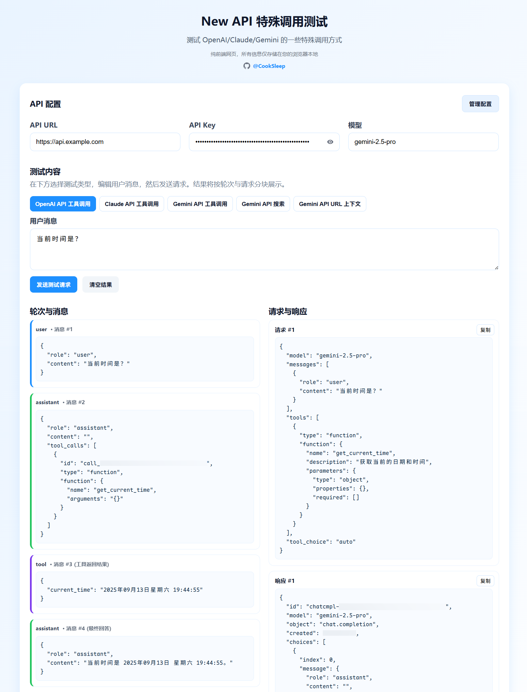

<h1 align="center">New API 特殊调用测试</h1>

<p align="center">纯前端的 <a href="https://github.com/QuantumNous/new-api">New API</a> 调用测试页面，用来测试 OpenAI/Claude/Gemini 的一些特殊调用方式。所有数据仅在浏览器本地处理与保存。</p>

<div align="center">
    
</div>

## 功能特性

- **纯前端与本地存储：**
  - 所有配置保存在浏览器 LocalStorage 中
  - 不上传数据到第三方服务器，安全可控
- **多厂商与多场景测试：**
  - **OpenAI:** 工具调用（Chat Completions/Responses）、搜索（Responses）
  - **Anthropic:** 工具调用
  - **Google Gemini:** 工具调用、搜索、URL 上下文
- **配置管理与一键默认：**
  - 通过“管理配置”弹窗新增/编辑/删除配置
  - 支持星标“默认配置”，页面加载自动应用
  - **安全性：** 支持 API Key 显隐切换，配置仅保存在本地 LocalStorage
- **交互与可视化：**
  - 分厂商切换测试类型，自动填充默认测试输入
  - 左侧“轮次与消息”时间线，右侧“请求与响应”代码块
  - 支持一键复制请求/响应内容
- **健壮的错误处理：**
  - 自动识别并提示错误的 API URL（如返回 HTML）
  - 支持非 JSON 响应的原始预览
  - 实时显示请求状态与耗时统计

## 如何使用

1. **直接打开页面：**
   - 用浏览器打开 https://cooksleep.github.io/newapi-special-test
2. **填写 API 信息：**
   - 在“API 配置”中填写 `API URL`、`API Key`、`模型`，或点击“管理配置”从右侧列表选择并应用。
3. **选择测试类型：**
   - 首先在“测试内容”中选择厂商（OpenAI / Anthropic / Google）。
   - 然后选择具体的测试场景（如工具调用、搜索等）。页面会自动填充推荐的测试消息。
4. **输入用户消息并发送：**
   - 在文本框输入用户消息，点击“发送测试请求”。
5. **查看结果：**
   - 左侧查看“轮次与消息”，右侧查看“请求与响应”。每个代码块都支持复制。

> 小贴士：该页面为纯前端网页，所有信息仅存储在您的浏览器本地。

## 修改默认系统配置

如需预置默认的 API URL、API Key、模型，可编辑 `assets/js/config.js` 中的 `window.APP_CONFIG`（部署到静态服务器时也可以按需修改）：

```js
window.APP_CONFIG = {
  apiUrl: 'https://api.openai.com',
  apiKey: '',
  model: 'gemini-3-flash-preview'
};
```

- 该文件在页面加载时先于主脚本注入，主脚本会读取 `window.APP_CONFIG` 作为系统默认。
- 不建议在公共仓库提交真实的 API Key，可保持为空，使用时手动填写或通过“管理配置”保存到本地。

## 部署

- 本项目为静态页面，可直接托管至任意静态托管平台（GitHub Pages、Netlify、Vercel、Nginx 等）。
- 如需覆盖默认配置，直接修改 `assets/js/config.js` 并重新部署即可。

## 贡献

欢迎对项目进行改进！如果你有新的想法或想要完善交互，请提交 Issue 或 Pull Request。

## 许可证

本项目采用 [GNU General Public License v3.0](https://www.gnu.org/licenses/gpl-3.0.html) 许可证，详情请见 [LICENSE](LICENSE) 文件。